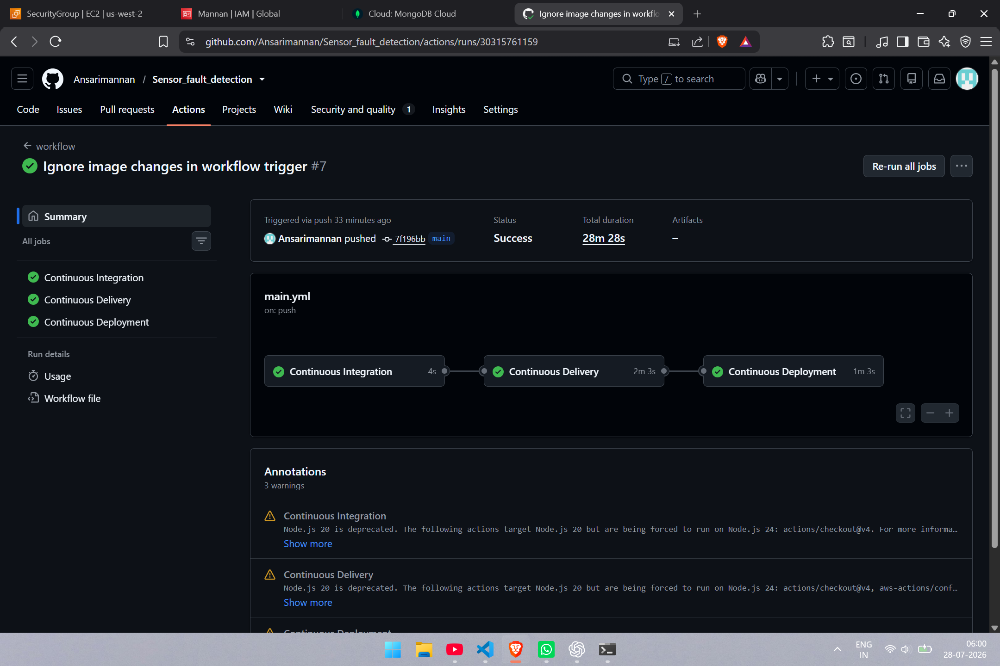
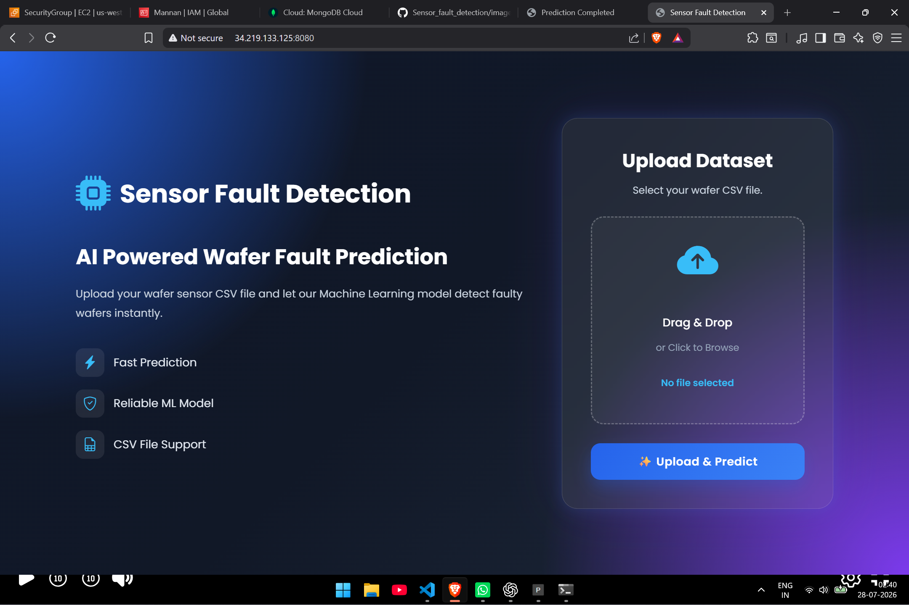
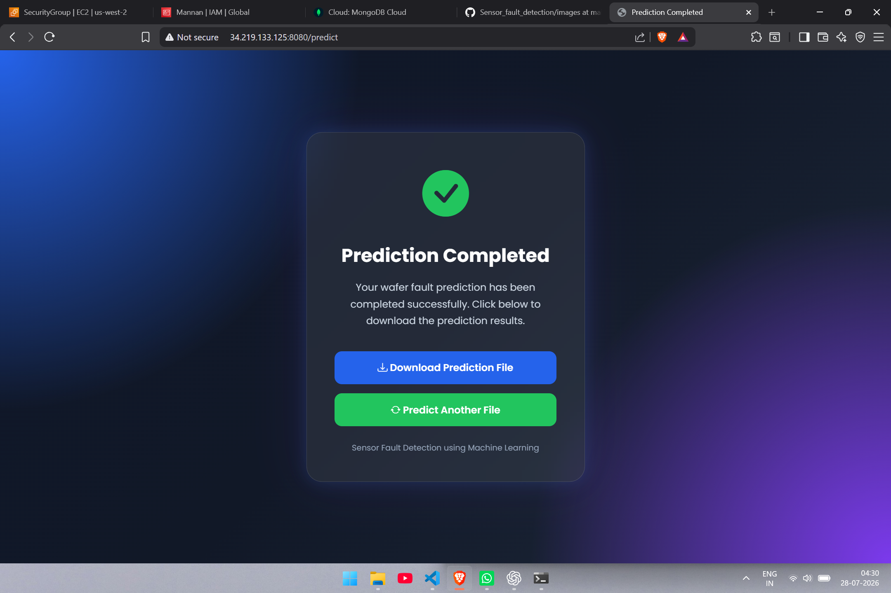

# 🚀 Sensor Fault Detection System

An End-to-End Machine Learning + MLOps project that predicts wafer sensor faults from CSV data.

## 🌐 Live Demo

http://34.219.133.125:8080

---

## 📌 Features

- Upload CSV file
- Detect faulty wafers
- Machine Learning prediction
- Clean and responsive UI
- End-to-End MLOps Pipeline
- Automatic Deployment using GitHub Actions

---

## 🛠 Tech Stack

### Machine Learning
- Python
- Scikit-learn
- Pandas
- NumPy

### Backend
- Flask

### Frontend
- HTML
- CSS
- JavaScript

### MLOps
- Docker
- GitHub Actions
- AWS EC2
- Amazon ECR

### Database
- MongoDB Atlas

---

## 🚀 CI/CD Pipeline

Every push to GitHub automatically:

✔ Builds Docker Image

✔ Pushes Docker Image to Amazon ECR

✔ Deploys latest container to AWS EC2

No manual deployment required.



---

## 📷 Screenshots

### Home Page



### Prediction Result



### GitHub Actions CI/CD Pipeline


## 📂 Project Structure

```
Sensor_fault_detection
│
├── app.py
├── Dockerfile
├── requirements.txt
├── src/
├── templates/
├── static/
├── config/
├── notebooks/
└── .github/workflows
```

---

## ⚙ Installation

Clone Repository

```bash
git clone https://github.com/Ansarimannan/Sensor_fault_detection.git
```

Install Dependencies

```bash
pip install -r requirements.txt
```

Run

```bash
python app.py
```

---

## 🐳 Docker

Build

```bash
docker build -t sensor .
```

Run

```bash
docker run -p 5000:5000 sensor
```

---

## ☁ AWS Deployment

Application deployed on:

- AWS EC2
- Amazon ECR
- GitHub Actions Self Hosted Runner

---

## 👨‍💻 Author

Mohd Mannan Ansari

B.Tech CSE (Data Science)

ABES Engineering College

GitHub:
https://github.com/Ansarimannan
